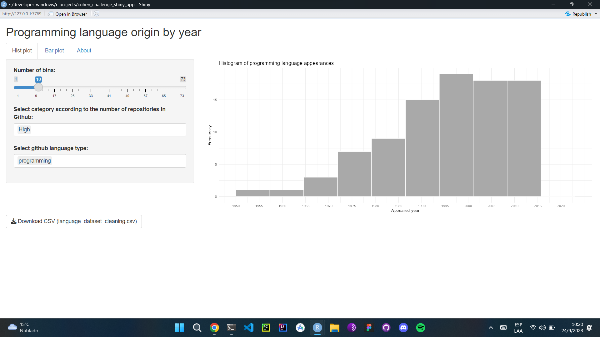
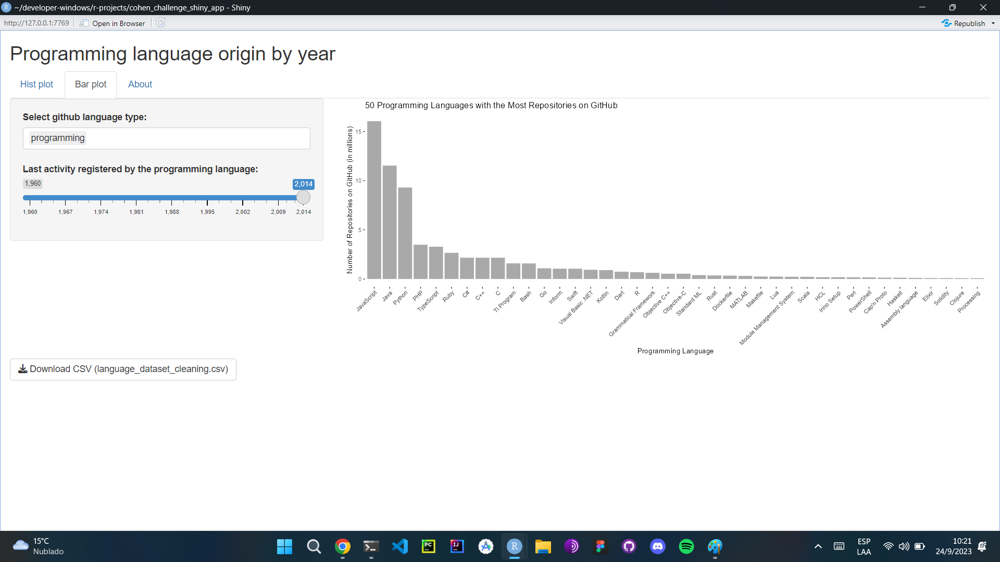

# Shiny App: Programming Language Analysis


## Overview

This Shiny App is designed to provide insights into programming languages, their origins, and various statistics related to them. It analyzes a dataset of programming languages and their attributes, allowing users to explore and visualize the data interactively.

## Technologies Used

- [R](https://www.r-project.org/): The programming language used for data analysis and Shiny app development.
- [Shiny](https://shiny.rstudio.com/): A web application framework for R, used to create the interactive user interface.
- [ggplot2](https://ggplot2.tidyverse.org/): A popular R package for creating data visualizations.
- [dplyr](https://dplyr.tidyverse.org/): A package for data manipulation and transformation.
- [openxlsx](https://cran.r-project.org/web/packages/openxlsx/index.html): An R package for reading and writing Excel files.

## Dataset

The dataset used in this Shiny App contains information about programming languages, including their origin years, the number of users, the number of GitHub repositories, and classification types. Here is a breakdown of the dataset's columns:

- `name`: The name of the programming language.
- `appeared`: The year in which the programming language first appeared.
- `number_of_users`: The number of users of the programming language.
- `github_language_repos`: The number of GitHub repositories related to the programming language.
- `github_language_type`: The classification type of the programming language.

## Features

This Shiny App offers the following features:

1. **Histogram Plot**: Visualize the distribution of programming language appearances over the years. Users can customize the number of bins and filter the data by GitHub language type and category by repositories.

2. **Bar Plot**: Explore the 50 programming languages with the most repositories on GitHub. Users can filter the data by GitHub language type and the last activity registered by the programming language.

3. **About Page**: Learn more about the Shiny App's purpose and development process, including data source and code availability.

4. **Download CSV**: Download the cleaned dataset as a CSV file for further analysis.

## Usage

To use the Shiny App:

1. Ensure you have R installed on your system.

2. Install the required packages using the following commands in your R console:

   ```R
   install.packages("shiny")
   install.packages("ggplot2")
   install.packages("dplyr")
   install.packages("openxlsx")
   ```

3. Clone or download the Shiny App code and dataset files from the GitHub repository.

4. Run the Shiny App by opening the R script and executing it. The app will open in your default web browser.

5. Explore and analyze programming language data using the interactive interface.

## Images




## Host

[ShinyApps.io](https://mgobeaalcoba.shinyapps.io/cohen_challenge_shiny_app/): The Shiny App can be used here. 

## Author

Mariano Gobea Alcoba

## Acknowledgments

This Shiny App was created as a part of a challenge for Cohen Aliados Financieros and is available on GitHub.

For any questions or inquiries, feel free to contact the author via LinkedIn or GitHub.
